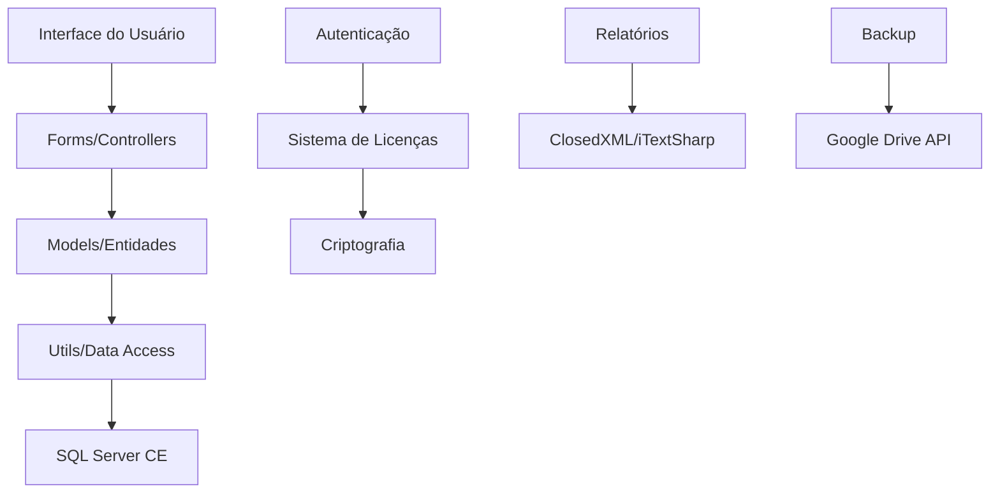

# BibliotecaApp - Sistema de Gerenciamento de Biblioteca


## 📋 Índice

- [Visão Geral](#-visão-geral)
- [Funcionalidades](#-funcionalidades)
- [Tecnologias Utilizadas](#-tecnologias-utilizadas)
- [Arquitetura do Sistema](#-arquitetura-do-sistema)
- [Instalação e Configuração](#-instalação-e-configuração)
- [Guia do Usuário](#-guia-do-usuário)
- [Documentação Técnica](#-documentação-técnica)
- [Desenvolvimento](#-desenvolvimento)
- [Suporte](#-suporte)

## 🔍 Visão Geral

O **BibliotecaApp** é um sistema desktop completo para gerenciamento de bibliotecas desenvolvido em C# Windows Forms. O sistema oferece controle total sobre usuários, acervo de livros, empréstimos, devoluções e relatórios gerenciais, sendo especialmente projetado para bibliotecas escolares e institucionais.

### Principais Características

- **Interface Intuitiva**: Design moderno e responsivo com Material Design
- **Segurança Robusta**: Autenticação com criptografia BCrypt e sistema de licenças
- **Gestão Completa**: Controle de usuários, livros, empréstimos e relatórios
- **Relatórios Avançados**: Exportação para Excel e PDF com filtros personalizados
- **Backup Automático**: Sincronização com Google Drive (opcional)
- **Acesso Remoto**: Funcionalidades específicas para secretaria escolar

## ⚡ Funcionalidades

### 🔐 Autenticação e Segurança
- Login seguro com diferentes níveis de acesso
- Criptografia de senhas com BCrypt
- Sistema de licenças com validação por chave
- Controle de permissões por tipo de usuário

### 👥 Gerenciamento de Usuários
- Cadastro de alunos, professores, bibliotecários e administradores
- Edição e exclusão de usuários
- Mapeamento inteligente de turmas
- Importação em lote de usuários

### 📚 Gerenciamento de Livros
- Cadastro completo com código de barras
- Controle de quantidade e disponibilidade
- Pesquisa avançada por gênero, autor e título
- Sistema de sugestões para gêneros padronizados

### 📖 Empréstimos e Devoluções
- Empréstimo tradicional com prazo definido
- Empréstimo rápido para agilidade
- Sistema de reservas
- Controle de atrasos e multas
- Histórico completo de movimentações

### 📊 Relatórios Gerenciais
- Relatórios de empréstimos por período
- Livros mais emprestados
- Usuários com atrasos
- Estatísticas gerais da biblioteca
- Exportação para Excel com formatação

### 🌐 Funcionalidades Especiais
- Acesso remoto para secretaria
- Backup automático em nuvem
- Ficha completa do aluno
- Dashboard com estatísticas em tempo real

## 🛠 Tecnologias Utilizadas

### Framework e Linguagem
- **.NET Framework 4.8**
- **C# Windows Forms**
- **MaterialSkin** - Interface moderna

### Banco de Dados
- **SQL Server Compact Edition (SQLCE)**
- **ADO.NET** para acesso a dados

### Bibliotecas Principais
- **BCrypt.Net** - Criptografia de senhas
- **ClosedXML** - Exportação para Excel
- **iTextSharp** - Geração de PDF
- **Google APIs** - Integração com Google Drive
- **Newtonsoft.Json** - Serialização JSON

### Segurança e Licenciamento
- **BouncyCastle** - Criptografia avançada
- Sistema proprietário de licenças
- Validação por chave pública/privada

## 🏗 Arquitetura do Sistema

### Estrutura de Pastas

```
BibliotecaApp/
├── Forms/                      # Interface do usuário
│   ├── Inicio/                # Tela principal e dashboard
│   ├── Login/                 # Autenticação
│   ├── Usuario/               # Gestão de usuários
│   ├── Livros/                # Gestão de livros e empréstimos
│   ├── Relatorio/             # Relatórios e exportações
│   └── Mapeamento/            # Mapeamento de turmas
├── Models/                     # Modelos de dados
├── Utils/                      # Utilitários e helpers
├── Elements/                   # Componentes customizados
├── BibliotecaDB/              # Banco de dados
└── Resources/                  # Recursos (imagens, ícones)
```

### Padrões Arquiteturais

- **MVP (Model-View-Presenter)**: Separação clara entre interface e lógica
- **Repository Pattern**: Acesso controlado aos dados
- **Singleton**: Para conexões e configurações globais
- **Factory**: Para criação de componentes de interface

### Fluxo de Dados



## 📦 Instalação e Configuração

### Pré-requisitos

- **Windows 7** ou superior
- **.NET Framework 4.8** ou superior
- **SQL Server Compact Edition 4.0**
- **Chave de licença válida**

### Instalação

1. **Download do Sistema**
   ```bash
   # Clone o repositório (para desenvolvedores)
   git clone https://github.com/Ithaloluzdepanela/biblioteca-gastao.git
   ```

2. **Configuração do Banco de Dados**
   - O banco `bibliotecaDB.sdf` já vem configurado
   - Senha padrão: `123`
   - Localização: `BibliotecaApp/BibliotecaDB/`

3. **Arquivo de Licença**
   - Coloque o arquivo `publicKey.xml` na pasta raiz do aplicativo
   - Obtenha a chave de ativação com o fornecedor

4. **Primeira Execução**
   - Execute `BibliotecaApp.exe`
   - Aceite os termos de uso
   - Insira a chave de ativação
   - Faça login com as credenciais padrão

### Configurações Opcionais

#### Backup Automático (Google Drive)
1. Configure o arquivo `credentials.json` com as credenciais da API do Google
2. Ative o backup automático no código (linha 83-102 do `Program.cs`)

#### Personalização de Interface
- Modifique os recursos em `Resources/` para personalizar ícones
- Ajuste cores e temas nos arquivos de design

## 👤 Guia do Usuário

### Login e Primeiro Acesso

1. **Tela de Login**
   - Insira usuário e senha
   - Diferentes tipos de usuário têm permissões específicas

2. **Dashboard Principal**
   - Visualize estatísticas em tempo real
   - Acesse funcionalidades via menu lateral
   - Use o botão "Empréstimo Rápido" para agilidade

### Gestão de Usuários

#### Cadastro de Usuários
1. Menu **Usuários** → **Cadastrar**
2. Preencha os dados obrigatórios:
   - Nome completo
   - Tipo de usuário (Aluno, Professor, etc.)
   - CPF (opcional)
   - Turma (para alunos)
3. Configure senha inicial
4. Salve o cadastro

#### Edição de Usuários
1. Menu **Usuários** → **Gerenciar**
2. Busque o usuário desejado
3. Clique em **Editar**
4. Modifique os dados necessários
5. Confirme as alterações

### Gestão de Livros

#### Cadastro de Livros
1. Menu **Livros** → **Cadastrar**
2. Preencha as informações:
   - Título do livro
   - Autor
   - Gênero (com sugestões automáticas)
   - Quantidade de exemplares
   - Código de barras (opcional)
3. Salve o cadastro

#### Consulta e Edição
1. Menu **Livros** → **Consultar**
2. Use filtros para buscar livros
3. Visualize disponibilidade
4. Edite informações conforme necessário

### Empréstimos e Devoluções

#### Empréstimo Tradicional
1. Menu **Empréstimos** → **Novo**
2. Selecione o usuário
3. Escaneie ou digite o código do livro
4. Defina prazo de devolução
5. Confirme o empréstimo

#### Empréstimo Rápido
1. Clique no botão **Empréstimo Rápido** (dashboard)
2. Digite dados do usuário
3. Escaneie o livro
4. Confirmação automática com prazo padrão

#### Devolução
1. Menu **Empréstimos** → **Devolução**
2. Escaneie o livro ou busque por usuário
3. Confirme a devolução
4. Sistema atualiza automaticamente

### Relatórios

#### Geração de Relatórios
1. Menu **Relatórios**
2. Selecione o tipo de relatório:
   - Empréstimos por período
   - Livros mais emprestados
   - Usuários com atraso
3. Configure filtros (datas, usuários, etc.)
4. Visualize na tela ou exporte

#### Exportação
- **Excel**: Formatação automática com filtros
- **PDF**: Layout profissional para impressão
- **Pasta**: Abre automaticamente após exportação

## 🔧 Documentação Técnica

### Modelos de Dados

#### Usuário (Usuarios.cs)
```csharp
public class Usuarios
{
    public int Id { get; set; }
    public string Nome { get; set; }
    public string TipoUsuario { get; set; }
    public string CPF { get; set; }
    public DateTime DataNascimento { get; set; }
    public string Telefone { get; set; }
    public string Email { get; set; }
    public string Turma { get; set; }
    public string Senha { get; set; }
}
```

#### Livro (Livro.cs)
```csharp
public class Livro
{
    public int Id { get; set; }
    public string Nome { get; set; }
    public string Autor { get; set; }
    public string Genero { get; set; }
    public bool Disponibilidade { get; set; }
    public int Quantidade { get; set; }
    public string CodigoDeBarras { get; set; }
}
```

#### Empréstimo (Emprestimo.cs)
```csharp
public class Emprestimo
{
    public int Id { get; set; }
    public int UsuarioId { get; set; }
    public int LivroId { get; set; }
    public DateTime DataEmprestimo { get; set; }
    public DateTime DataPrevistaDevolucao { get; set; }
    public DateTime? DataRealDevolucao { get; set; }
    public int ResponsavelId { get; set; }
}
```

### Conexão com Banco de Dados

```csharp
public static class Conexao
{
    public static string CaminhoBanco => 
        Application.StartupPath + @"\bibliotecaDB\bibliotecaDB.sdf";
    
    public static string Conectar => 
        $"Data Source={CaminhoBanco}; Password=123";
    
    public static SqlCeConnection ObterConexao()
    {
        return new SqlCeConnection(Conectar);
    }
}
```

### Sistema de Segurança

#### Criptografia de Senhas
```csharp
public static class CriptografiaSenha
{
    public static string CriptografarSenha(string senha)
    {
        return BCrypt.Net.BCrypt.HashPassword(senha);
    }
    
    public static bool VerificarSenha(string senha, string hash)
    {
        return BCrypt.Net.BCrypt.Verify(senha, hash);
    }
}
```

### APIs e Integrações

#### Google Drive API
- Backup automático do banco de dados
- Sincronização de arquivos de configuração
- Autenticação OAuth 2.0

#### Exportação de Relatórios
- **ClosedXML**: Planilhas Excel com formatação
- **iTextSharp**: PDFs com layout customizado

## 💻 Desenvolvimento

### Ambiente de Desenvolvimento

1. **Visual Studio 2019** ou superior
2. **.NET Framework 4.8 SDK**
3. **SQL Server Management Studio** (opcional)
4. **Git** para controle de versão

### Configuração do Projeto

```bash
# Clone o repositório
git clone https://github.com/Ithaloluzdepanela/biblioteca-gastao.git

# Abra no Visual Studio
cd biblioteca-gastao/BibliotecaApp
start BibliotecaApp.sln

# Restaure os pacotes NuGet
dotnet restore
```

### Estrutura de Desenvolvimento

#### Convenções de Código
- **Pascal Case** para métodos e propriedades públicas
- **Camel Case** para variáveis locais
- **Comentários XML** para documentação de métodos públicos
- **Regions** para organização de código

#### Padrões de Nomenclatura
- **Forms**: `[Funcionalidade]Form.cs` (ex: `LoginForm.cs`)
- **Models**: `[Entidade].cs` (ex: `Usuario.cs`)
- **Utils**: `[Funcionalidade].cs` (ex: `Conexao.cs`)

### Contribuição

1. **Fork** o repositório
2. **Crie** uma branch para sua feature (`git checkout -b feature/nova-funcionalidade`)
3. **Commit** suas mudanças (`git commit -m 'Adiciona nova funcionalidade'`)
4. **Push** para a branch (`git push origin feature/nova-funcionalidade`)
5. **Abra** um Pull Request

## 📞 Suporte

### Contato

- **Desenvolvedor**: Ithalo Pimentel
- **Email**: [inserir email]
- **Empresa**: Beverso
- **GitHub**: https://github.com/Ithaloluzdepanela/biblioteca-gastao

### Problemas Comuns

#### "Arquivo publicKey.xml não encontrado"
- **Solução**: Coloque o arquivo de licença na pasta do executável

#### "Erro de conexão com banco de dados"
- **Verifique**: Se o arquivo `bibliotecaDB.sdf` está na pasta correta
- **Verifique**: Se o SQL Server Compact Edition está instalado

#### "Licença expirada"
- **Solução**: Entre em contato para renovação da licença

### Logs e Depuração

- **Logs de erro**: Verificar eventos do Windows
- **Backup logs**: Pasta `AppData/Local/BibliotecaApp`
- **Debug**: Usar Visual Studio com símbolos de depuração

---

## 📄 Licença

Este software é propriedade da **Beverso** e está protegido por direitos autorais. O uso é permitido apenas mediante licença válida. Para mais informações sobre licenciamento, consulte os termos de uso do aplicativo.

---

**BibliotecaApp** - Sistema de Gerenciamento de Biblioteca  
© 2025 Beverso. Todos os direitos reservados.