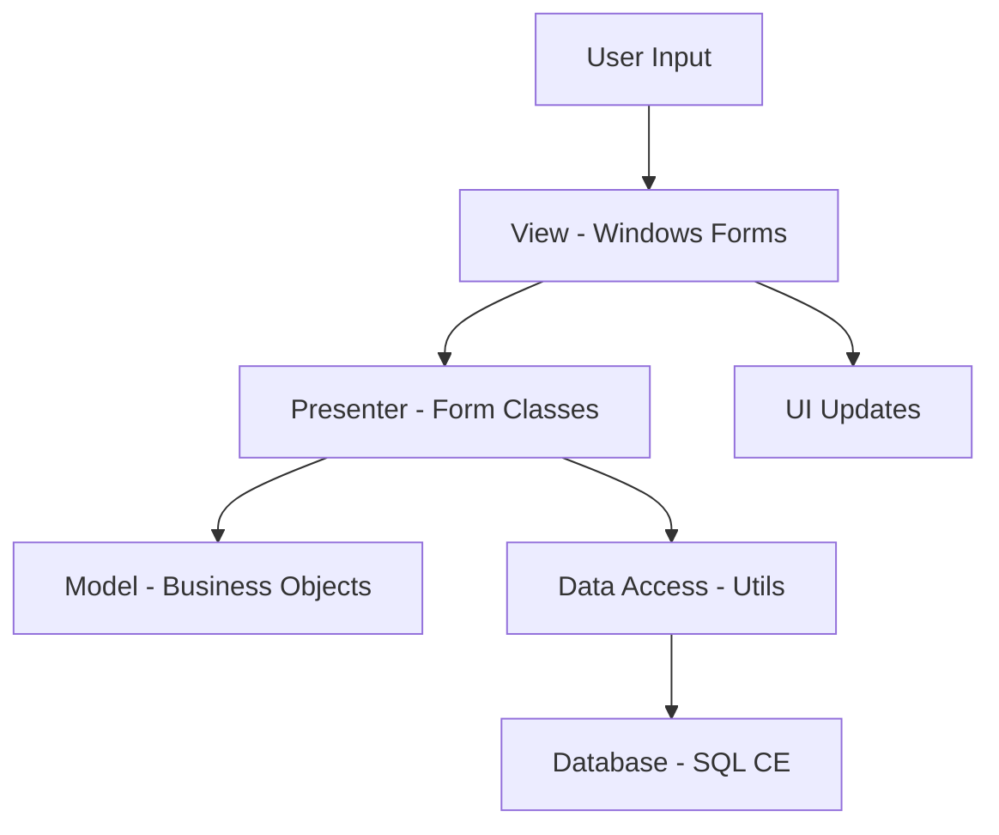
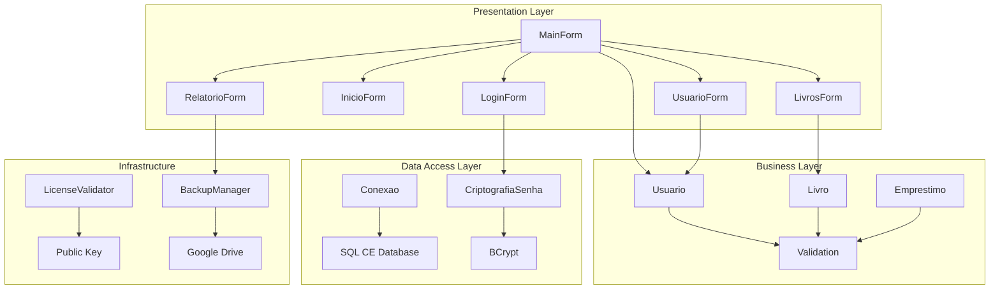
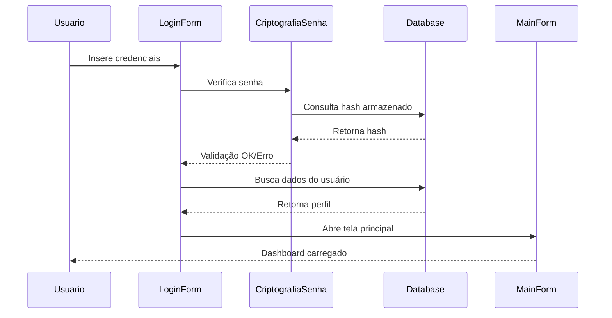
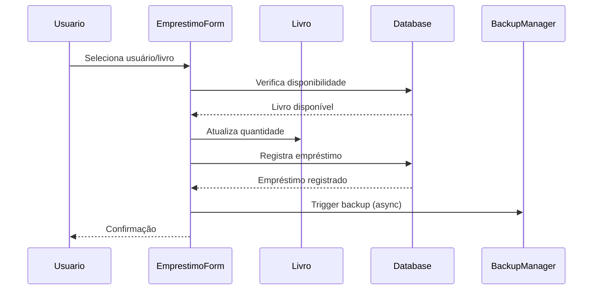
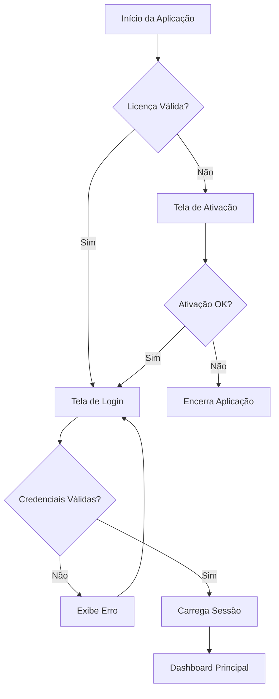
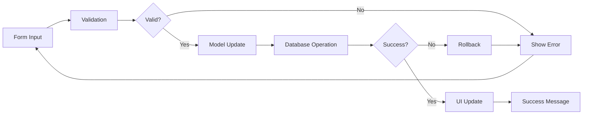
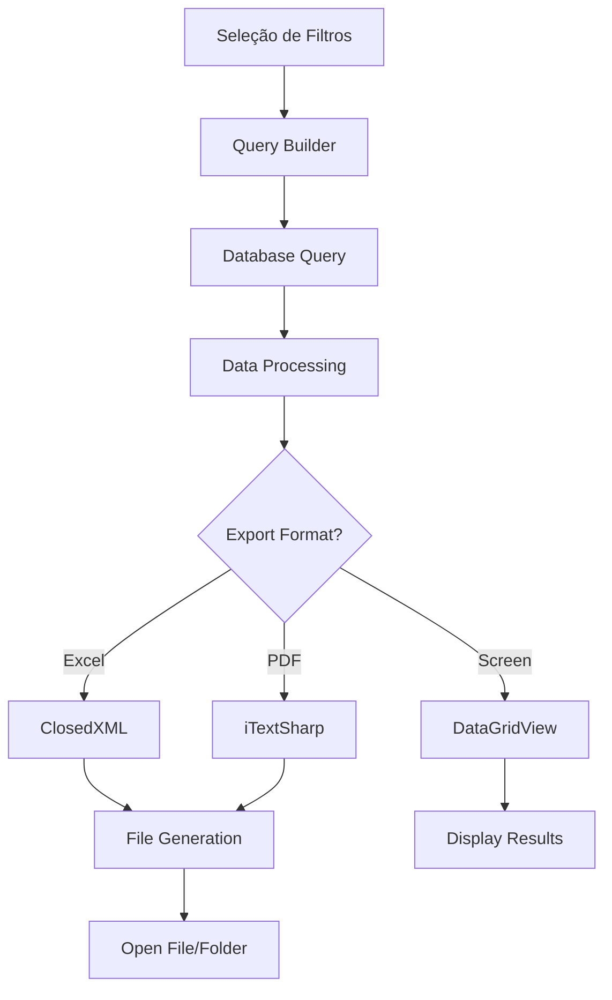

# Arquitetura do Sistema BibliotecaApp

## 📋 Índice

- [Visão Geral da Arquitetura](#visão-geral-da-arquitetura)
- [Padrões Arquiteturais](#padrões-arquiteturais)
- [Estrutura de Camadas](#estrutura-de-camadas)
- [Diagramas do Sistema](#diagramas-do-sistema)
- [Fluxo de Dados](#fluxo-de-dados)
- [Segurança](#segurança)
- [Performance](#performance)
- [Escalabilidade](#escalabilidade)

## 🏗 Visão Geral da Arquitetura

O BibliotecaApp segue uma arquitetura em camadas baseada no padrão **MVP (Model-View-Presenter)** com elementos do padrão **Repository**, proporcionando uma separação clara de responsabilidades e facilitando a manutenção e evolução do sistema.

### Princípios Arquiteturais

- **Separação de Responsabilidades**: Cada camada tem uma responsabilidade específica
- **Baixo Acoplamento**: Dependências minimizadas entre componentes
- **Alta Coesão**: Funcionalidades relacionadas agrupadas
- **Reutilização**: Componentes e utilitários compartilhados
- **Testabilidade**: Estrutura que facilita testes unitários

## 🎯 Padrões Arquiteturais

### MVP (Model-View-Presenter)



#### View (Apresentação)
- **Responsabilidade**: Interface do usuário e captura de eventos
- **Localização**: `Forms/` e `Elements/`
- **Tecnologia**: Windows Forms com Material Design

#### Presenter (Controle)
- **Responsabilidade**: Lógica de apresentação e coordenação
- **Localização**: Code-behind dos Forms
- **Padrão**: Event-driven com delegates

#### Model (Modelo)
- **Responsabilidade**: Entidades de negócio e regras
- **Localização**: `Models/`
- **Características**: POCOs (Plain Old CLR Objects)

### Repository Pattern

```csharp
// Exemplo conceitual - não implementado explicitamente
public interface IUsuarioRepository
{
    void Inserir(Usuario usuario);
    Usuario BuscarPorId(int id);
    List<Usuario> BuscarTodos();
    void Atualizar(Usuario usuario);
    void Excluir(int id);
}
```

### Singleton Pattern

```csharp
// Implementado em Conexao.cs
public static class Conexao
{
    private static readonly string connectionString = "...";
    
    public static SqlCeConnection ObterConexao()
    {
        return new SqlCeConnection(connectionString);
    }
}
```

## 🔄 Estrutura de Camadas

### 1. Camada de Apresentação (Presentation Layer)

```
Forms/
├── Inicio/           # Dashboard e tela principal
├── Login/            # Autenticação e acesso
├── Usuario/          # Gestão de usuários
├── Livros/           # Gestão de acervo
├── Relatorio/        # Relatórios e exportações
└── Mapeamento/       # Funcionalidades especiais
```

**Características:**
- Windows Forms com controles customizados
- Material Design para UX moderna
- Validação de entrada no lado cliente
- Binding de dados bidirectional

### 2. Camada de Negócio (Business Layer)

```
Models/
├── Usuario.cs        # Entidade de usuário
├── Livro.cs          # Entidade de livro
├── Emprestimo.cs     # Entidade de empréstimo
├── Sessao.cs         # Controle de sessão
└── MapeamentoModel.cs # Modelos auxiliares
```

**Responsabilidades:**
- Validação de regras de negócio
- Encapsulamento de dados
- Lógica de domínio
- Transformação de dados

### 3. Camada de Acesso a Dados (Data Access Layer)

```
Utils/
├── Conexao.cs        # Gerenciamento de conexões
├── CriptografiaSenha.cs # Segurança de dados
├── BackupManager.cs  # Backup e recuperação
└── EmailService.cs   # Serviços externos
```

**Características:**
- ADO.NET para acesso direto ao banco
- SQL Server Compact Edition
- Transações para integridade
- Pool de conexões implícito

### 4. Camada de Infraestrutura

```
Utils/
├── LicenseValidator.cs # Sistema de licenças
├── AppPaths.cs        # Gerenciamento de caminhos
├── TurmasUtil.cs      # Utilitários específicos
└── mdiProperties.cs   # Configurações MDI
```

## 📊 Diagramas do Sistema

### Diagrama de Componentes



### Diagrama de Sequência - Login



### Diagrama de Sequência - Empréstimo



## 🔀 Fluxo de Dados

### Fluxo de Autenticação



### Fluxo de Dados - CRUD



### Fluxo de Relatórios



## 🔐 Segurança

### Camadas de Segurança

1. **Licenciamento**
   - Validação por chave pública/privada
   - Controle de expiração
   - Hardware binding (opcional)

2. **Autenticação**
   - Hash BCrypt para senhas
   - Sessões controladas
   - Timeout automático

3. **Autorização**
   - Perfis de usuário com permissões
   - Controle de acesso por funcionalidade
   - Logs de auditoria

4. **Dados**
   - Banco criptografado (SQL CE com senha)
   - Backup criptografado
   - Sanitização de inputs

### Implementação de Segurança

```csharp
// Exemplo de validação de senha
public static bool ValidarLogin(string usuario, string senha)
{
    var hashArmazenado = BuscarHashSenha(usuario);
    return BCrypt.Net.BCrypt.Verify(senha, hashArmazenado);
}

// Exemplo de controle de acesso
public bool TemPermissao(TipoUsuario tipo, Funcionalidade funcao)
{
    var permissoes = ObterPermissoes(tipo);
    return permissoes.Contains(funcao);
}
```

## ⚡ Performance

### Otimizações Implementadas

1. **Banco de Dados**
   - Índices em campos de busca frequente
   - Consultas otimizadas com JOIN
   - Pool de conexões

2. **Interface**
   - Loading assíncrono em operações longas
   - Paginação em listagens grandes
   - Cache de dados frequentes

3. **Memória**
   - Dispose adequado de recursos
   - Weak references para eventos
   - Garbage collection otimizado

### Monitoramento

```csharp
// Exemplo de monitoramento de performance
public class PerformanceMonitor
{
    private static readonly Stopwatch stopwatch = new Stopwatch();
    
    public static void StartMeasure(string operation)
    {
        stopwatch.Restart();
        Log($"Iniciando: {operation}");
    }
    
    public static void EndMeasure(string operation)
    {
        stopwatch.Stop();
        Log($"Concluído: {operation} - {stopwatch.ElapsedMilliseconds}ms");
    }
}
```

## 📈 Escalabilidade

### Limitações Atuais

- **SQL Server CE**: Máximo 4GB de dados
- **Desktop**: Aplicação single-user
- **Concorrência**: Limitada a uma instância

### Estratégias de Evolução

1. **Migração de Banco**
   ```sql
   -- De SQL CE para SQL Server
   -- Maior capacidade e performance
   -- Suporte a múltiplos usuários
   ```

2. **Arquitetura Cliente-Servidor**
   ```
   Desktop Client -> Web API -> SQL Server
   ```

3. **Componentização**
   ```
   Core Library -> Multiple Interfaces
   (Desktop, Web, Mobile)
   ```

### Padrões para Escalabilidade

```csharp
// Interface para repositórios
public interface IRepository<T>
{
    Task<T> GetByIdAsync(int id);
    Task<IEnumerable<T>> GetAllAsync();
    Task<T> AddAsync(T entity);
    Task UpdateAsync(T entity);
    Task DeleteAsync(int id);
}

// Implementação assíncrona
public class UsuarioRepository : IRepository<Usuario>
{
    public async Task<Usuario> GetByIdAsync(int id)
    {
        // Implementação assíncrona
    }
}
```

## 🔧 Configuração e Deployment

### Configurações de Ambiente

```xml
<!-- App.config -->
<configuration>
  <connectionStrings>
    <add name="BibliotecaDB" 
         connectionString="Data Source=bibliotecaDB.sdf;Password=123" />
  </connectionStrings>
  
  <appSettings>
    <add key="BackupEnabled" value="true" />
    <add key="LicenseCheckInterval" value="24" />
  </appSettings>
</configuration>
```

### Estratégia de Deployment

1. **Build Automatizado**
   - MSBuild scripts
   - Versionamento automático
   - Empacotamento de dependências

2. **Distribuição**
   - Installer com dependencies
   - Auto-update capability
   - Rollback de versões

3. **Monitoramento**
   - Logs centralizados
   - Health checks
   - Error reporting

---

Esta documentação de arquitetura serve como guia para desenvolvedores e arquitetos que trabalham com o BibliotecaApp, fornecendo uma visão completa da estrutura, padrões e decisões técnicas do sistema.